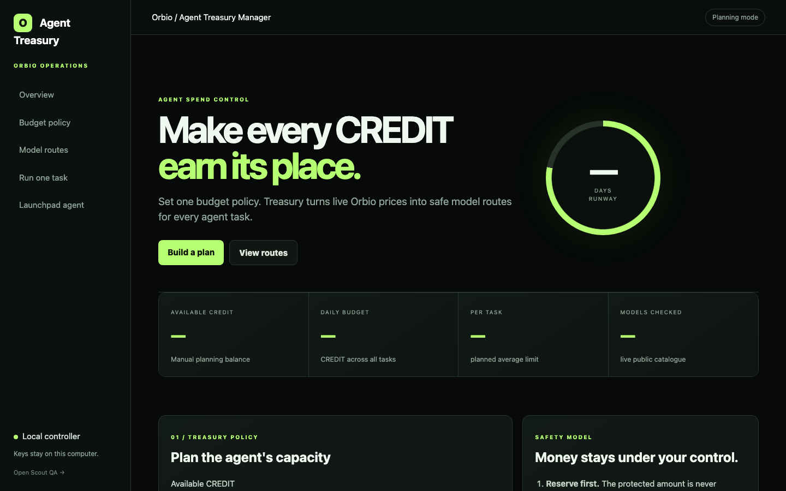
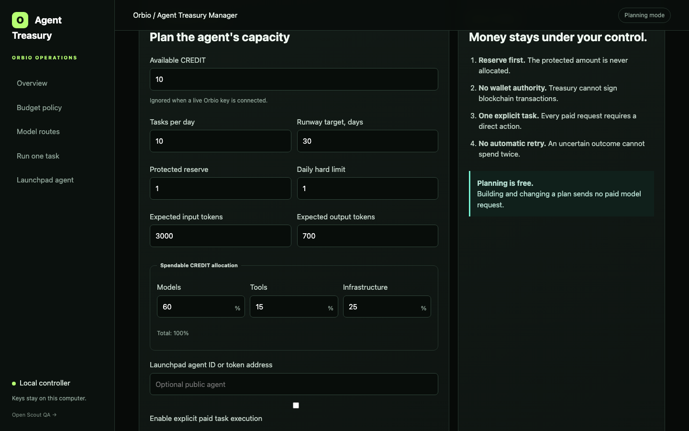
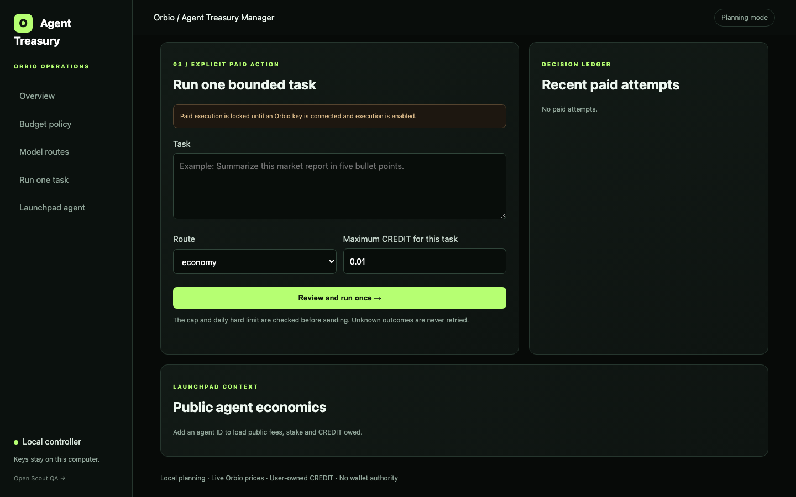
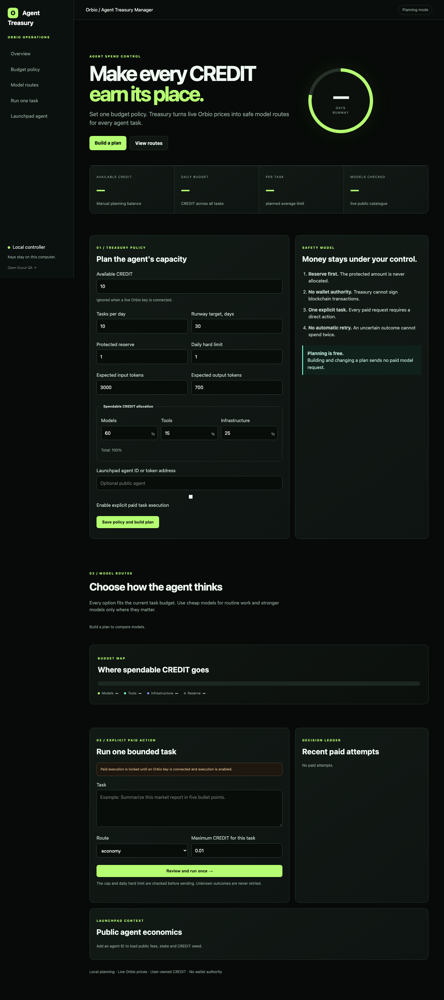

# Orbio Agent Treasury Manager

> Local spend control, model routing, and decision evidence for agents running through Orbio.

Agent Treasury Manager turns an Orbio balance into an explicit operating policy. It helps an operator decide how much an agent can spend, which model routes fit the task, what reserve must remain protected, and whether a paid action may run.

- **Status:** active development
- **Product:** private local application
- **Platform:** Orbio model and tool gateway
- **Repository:** public engineering case study, no source code

## What Orbio is

[Orbio](https://www.orbio.so/developers/docs) provides one account and balance for products using AI models, tools, and managed agent infrastructure.

Its developer platform includes:

- an OpenAI-compatible inference gateway;
- model, web, social, and onchain capabilities;
- OAuth 2.1 with PKCE for user-owned connections;
- balance and usage access for cost-aware products;
- isolated permissions for sandboxes, deployments, servers, databases, and inboxes;
- optional application fees for developers building on the platform.

Treasury Manager is the operating layer around that infrastructure. Orbio provides access and billing; Treasury Manager decides when an agent is allowed to spend and records what happened.

## The problem

Multi-model access creates a new operational problem. Agents can choose stronger routes, retry uncertain requests, and consume a shared balance without understanding runway or business priority.

A raw balance does not answer:

- how much can be spent today;
- how many tasks remain affordable;
- which model is appropriate for this task;
- what amount must stay protected;
- whether an uncertain call can be repeated safely;
- whether estimated and actual spend match.

Treasury Manager makes those decisions visible before execution.

## Operating model

**Connect -> price -> plan -> approve -> execute -> reconcile -> record**

1. The operator connects their own Orbio credential.
2. Treasury reads the current CREDIT balance and public model catalogue.
3. The operator sets reserve, daily limit, expected workload, and per-task cap.
4. The planner compares only routes that fit the active policy.
5. Paid execution remains locked until the operator enables it explicitly.
6. One bounded request is sent through the selected Orbio route.
7. Treasury reads the balance again and reconciles actual spend.
8. The decision and outcome are written to a local ledger.

Planning does not send a paid model request. Treasury Manager cannot sign wallet transactions.

## Product surface

### Overview

The first screen shows the numbers needed for an operating decision: available CREDIT, daily budget, average task allowance, model coverage, and projected runway.

### Budget policy

The policy combines financial constraints with expected workload:

- protected reserve;
- daily hard limit;
- task volume and runway target;
- expected input and output tokens;
- per-task CREDIT ceiling;
- allocation across models, tools, and infrastructure.

### Model routes

Live public pricing is converted into comparable routes. Cheap models can cover routine tasks while stronger routes remain available only when the policy can afford them.

### Explicit paid action

Execution is a separate state from planning. The operator selects a route, reviews a maximum CREDIT amount, and confirms one bounded task.

### Decision ledger

The local ledger records the route, estimate, policy result, balance delta, and final status. Task text and model responses are not stored in the ledger.

## Technical architecture

| Layer | Responsibility |
| --- | --- |
| Local control service | Coordinates policy evaluation, planning, execution locks, and reconciliation. |
| Browser workspace | Presents balance, runway, route options, controls, and decision history. |
| Orbio adapter | Reads balance and model availability, then sends explicitly approved requests. |
| Cost engine | Estimates task cost from route pricing and expected token usage. |
| Policy engine | Applies reserve, daily budget, allocation, and per-task constraints. |
| Execution guard | Allows one paid request at a time and blocks unapproved retries. |
| Decision ledger | Persists compact operational evidence without prompts, responses, or credentials. |
| Launchpad context | Reads public agent economics such as fees, stake, and CREDIT owed. |

The current product is implemented as a local Python service with a browser interface and a SQLite-backed policy and decision ledger. Provider access is isolated behind an adapter so pricing, balance, and execution logic can be tested separately from the interface.

## Budget logic

Treasury converts CREDIT into a policy in a fixed order:

1. Protect the configured reserve.
2. Apply the daily hard limit.
3. Allocate spendable CREDIT across models, tools, and infrastructure.
4. Divide the model budget by expected task volume and runway.
5. Reject routes above the per-task cap.
6. Present affordable routes with their estimated cost.
7. Reconcile the estimate against the post-request balance.

This keeps the recommendation deterministic and explainable. A model is not considered affordable simply because the current balance can cover one call.

## Failure model

| Condition | Product behavior |
| --- | --- |
| No Orbio credential | Planning remains available; paid execution is disabled. |
| Insufficient balance | The request is blocked before inference. |
| Reserve violation | The route is rejected with the policy reason. |
| Daily or task cap exceeded | Execution remains locked. |
| Pricing is stale or unavailable | No current estimate is presented as reliable. |
| Another request is running | A second paid action cannot start. |
| Provider outcome is unknown | The attempt is recorded and never retried automatically. |
| Balance reconciliation differs | Estimated and observed spend remain visible for review. |

An API response and a financially safe outcome are treated as two different things.

## Local security boundaries

- Credentials stay in process memory and are not written to the ledger.
- The service binds to loopback rather than a public interface.
- Local control requests require a per-process session token.
- Cross-origin control requests are rejected.
- Paid execution is disabled by default.
- The operator must connect a credential, enable execution, choose a route, set a cap, and confirm the task.
- Unknown paid outcomes are never retried automatically.
- Wallet signing is outside the product's authority.

## UI decisions

The interface is intentionally built around decisions rather than provider internals.

1. **Runway before spend.** Balance is translated into days and tasks, not shown as an isolated number.
2. **Policy before model.** Routes appear only after financial constraints are defined.
3. **Approval before execution.** Planning and paid action are separate modes.
4. **Observed cost after execution.** Balance reconciliation closes the loop.
5. **Progressive detail.** Logs and route metadata remain secondary to the current decision.

## What works today

- manual planning without paid inference;
- live Orbio balance and public model catalogue reads;
- deterministic CREDIT allocation and runway calculation;
- model-route comparison using current pricing;
- protected reserve, daily hard limit, and per-task cap;
- explicit paid-execution gate;
- single-flight request locking;
- before-and-after balance reconciliation;
- local decision ledger without prompt or response storage;
- public Launchpad agent economics context.

## Product direction

- Sign in with Orbio for a smoother user-owned connection;
- reusable policies for different agent roles;
- route performance history based on task outcomes;
- estimated-versus-actual spend analytics;
- team approval roles and policy ownership;
- alerts for runway, unusual spend, and provider drift;
- agent earnings and operating costs in one treasury view.

## Related product

[Scout](https://github.com/0xENTYPER/scout-agent) remains a separate local QA product for repeatable checks and bounded repair candidates. Treasury Manager focuses specifically on agent economics, model routing, and paid execution controls.

## Public scope

This repository contains a real product screenshot and a description of the product model, architecture, safety boundaries, and current capabilities.

The application source, credentials, private test data, production configuration, and internal account details remain private.

View the complete Treasury Manager workspace

---

Built by [0xENTYPER](https://github.com/0xENTYPER).
